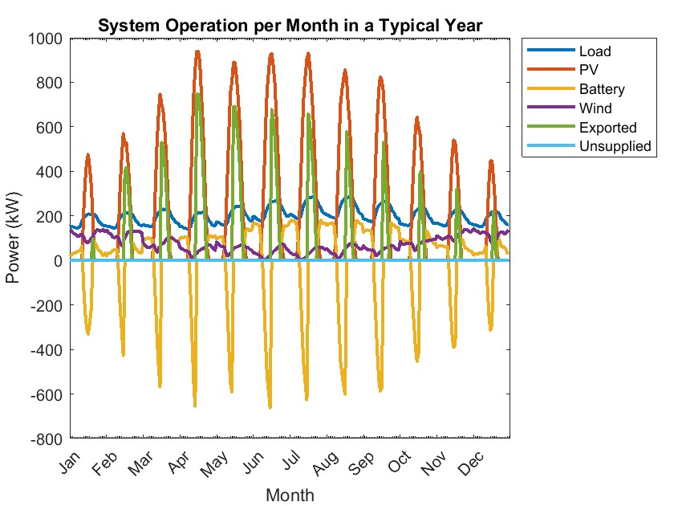

# Optimization of Hybrid Solar-Wind Energy System for Hospital in London

## Introduction

This MATLAB-based optimization project designs a **hybrid energy system** for  a hospital located in London, UK, using **solar PV**, **wind turbines**, and **battery storage**. The goal is to minimize **energy costs** and **grid dependency** while ensuring a **reliable power supply** for medical operations.

## Project Description

This system is optimized using a **Genetic Algorithm (GA)** to determine the optimal configuration that minimizes the total system investment cost over a 10-year lifetime, while fulfilling the following constraints:

- **SOC Constraints:** The state of charge (SOC) of the battery must remain within 50% to 90%.
- **Power Supply Constraints:** The system must meet the energy load requirements, with excess energy being exported.
- **Space Constraints:** The total space required for the PV panels and wind turbines must not exceed the usable area of the hospital’s rooftop or nearby land.

The optimization procedure also integrates a financial analysis to evaluate the feasibility and payback period of the system based on energy savings and export revenues via the Smart Export Guarantee (SEG) scheme.

## System Specifications

### 1. Solar PV System
- **Rated Power:** 485W per panel
- **Efficiency:** 22.4%
- **Temperature Coefficient:** -0.29% per °C
- **Degradation Rate:** 0.4% per year

### 2. Wind Turbines
- **Rated Power:** 2kW per turbine
- **Efficiency:** 92%
- **Wind Speed:** Optimized for London’s average wind speeds (4-6 m/s)

### 3. Battery Storage
- **Capacity:** 4560 Wh per cell
- **Efficiency:** 98%
- **Depth of Discharge (DoD):** 95%

## Optimization Methodology

###   Model Inputs

**Time Resolution:**

$$
\Delta T = 0.5 \text{ hr} \quad \text{(12 days × 24 hr = 288 hours)}
$$

**Scaled Load Profile:**

$$
P_{\text{load}}(t) = P_{\text{load,raw}}(t) \cdot (1 + g)^{y}, \quad g = 0.025, \quad y = 10
$$

###  System Equations

####  PV Output

$$
P_{\text{PV}}(t) = N_{\text{pv}} \cdot \eta_{\text{PV}} \cdot \frac{P_{\text{STC}}}{G_{\text{STC}}} \cdot \left(1 + C_T(T(t) - T_{\text{STC}})\right) \cdot G(t) \cdot (1 - r_{\text{deg}})^{y-1}
$$

####   Wind Turbine Output

$$
P_{\text{wind}}(t) = N_{\text{turb}} \cdot \left( A + B \cdot v(t) + C \cdot v(t)^2 \right) \cdot P_{\text{turb}}
$$

Where \( A, B, C \) are constants computed from cut-in $$\(v_{ci} = 2.5\)$$ and rated speed $$\(v_r = 10\)$$.

####  Battery State of Charge (SOC)

$$
SOC(t+1) = SOC(t) + \frac{\eta_{\text{bat}} \cdot P_{\text{bat}}(t) \cdot \Delta T}{N_{\text{cell}} \cdot C_{\text{cell}}}
$$

#### Power Output 

$$
P_{\text{total}} = \eta_{\text{DCDC}} \cdot P_{\text{PV}}(t) + \eta_{\text{ACDCw}} \cdot P_{\text{wind}}(t)
$$

## Objective Function

Minimize total cost over 10 years:

$$
C(X) = min (N_{\text{pv}} (C_{\text{inv,panel}} + OPEX_{\text{PV}}) + N_{\text{cell}} (C_{\text{inv,cell}} + OPEX_{\text{Battery}}) + N_{\text{turb}} (C_{\text{inv,turb}} + OPEX_{\text{Wind}}))
$$

## Constraints
### **Lower and Upper Bounds**

$$
X_l = [1, \, N_{\text{cell,min}}, \, N_{\text{turb,min}}, \, SOC_{\text{ini,min}}]
$$

$$
X_u = [N_{\text{pv,max}}, \, N_{\text{cell,max}}, \, N_{\text{turb,max}}, \, SOC_{\text{ini,max}}]
$$

  
### Inequality Constraints

$$
\begin{aligned}
& SOC_{\text{min}} \leq SOC(t) \leq SOC_{\text{max}} \\
& \max(P_{\text{unsup}}(t)) = 0 \\
& SOC(0) = SOC(T_{\text{end}}) \\
& N_{\text{pv}} \cdot A_{\text{pv}} + N_{\text{turb}} \cdot A_{\text{turb}} \leq A_{\text{usable}}
\end{aligned}
$$

### Variable Bounds

$$
\begin{aligned}
1 &\leq N_{\text{pv}} \leq \left\lfloor \frac{A_{\text{usable}}}{A_{\text{pv}}} \right\rfloor \\
10 &\leq N_{\text{cell}} \leq 1000 \\
0 &\leq N_{\text{turb}} \leq \left\lfloor \frac{A_{\text{usable}}}{A_{\text{turb}}} \right\rfloor \\
SOC_{\text{min}} &\leq SOC_{\text{init}} \leq SOC_{\text{max}}
\end{aligned}
$$

## Optimization Method

MATLAB’s **Genetic Algorithm** is used to solve:

$$
\min_{X \in \mathbb{R}^4} \quad C(X) \quad \text{subject to constraints}
$$

**GA Settings:**

- Population Size: 500  
- Max Generations: 10,000  
- Function Tolerance: $$\(10^{-12}\)$$  
- Constraint Tolerance: $$\(10^{-3}\)$$

The **genetic algorithm** (`ga()`) used to find the optimal configuration is as seen below:

$$[Xopt, cost] = ga(obj, 4, [], [], [], [], Xl, Xu, nlconstraints, [1 2 3], options)$$

## Result and Analysis

By running `plottedfigures.py`, the following results were obtained:
| **Figure** | **Description** |
|------------|-----------------|
|   **Fig 1**: System Operation per Month in a Typical Year | **Key Observations**:   - **PV Output**: Peaks at 600 kW in summer, drops below 100 kW in winter.   - **Wind Power**: Stays stable between 50–150 kW, compensating for solar fluctuations.   - **Battery Storage**: At 200 kW, it smooths fluctuations by charging during high generation periods and discharging when demand exceeds supply.   - **Exported Power**: Ranges from 400–600 kW, with significant export in summer.   - **Unsupplied Load**: Remains near zero, indicating optimal system sizing. |

| **Year** | **Cash Flow** | **Cumulative Cash Flow** |
|----------|---------------|--------------------------|
| 0        | $(1,803,400.00) | $(1,803,400.00)           |
| 1        | $310,107.52     | $(1,493,292.48)           |
| 2        | $317,860.21     | $(1,175,432.26)           |
| 3        | $325,806.72     | $(849,625.55)             |
| 4        | $333,951.89     | $(515,673.66)             |
| 5        | $342,300.68     | $(173,372.98)             |
| 6        | $350,858.20     | $177,485.22               |
| 7        | $359,629.65     | $537,114.87               |
| 8        | $368,620.40     | $905,735.27               |
| 9        | $377,835.91     | $1,283,571.18             |
| 10       | $387,281.80     | $1,670,852.98             |

**TIR**: 0.1348  
**Payback Period (Years)**: 6  
**Total Benefits**: €1,670,852.98
### **Optimization Results**

The optimization results indicate an optimal configuration for the renewable energy system, balancing **cost efficiency** and **energy supply reliability**. The solution provides the following key component capacities:

- **PV Panels**: 2,504 units (1.21 MW)
- **Wind Turbines**: 530 units (1.06 MW)
- **Battery Storage**: 304 units (1.39 MWh)
- **Final State of Charge (SOC)**: 0.65

#### **Key Insights**:
- The **total system cost** is **€1.824 million**.
- The system ensures **adequate energy generation** while maintaining **cost-effectiveness**.
- **Solar energy** is the primary source of energy, with **wind turbines** and **battery storage** playing complementary roles to ensure energy security and grid independence.
- The **unsupplied power** remains **zero**, and the **SOC** of the battery does not fall below 0.5, respecting the **battery management system (BMS)** constraints.

## Steps to Run the Project
The optimization model is implemented in MATLAB and follows these steps:
1. **Input Data:** Load the hospital's energy load profile, solar irradiance, wind speed, and temperature data.
2.  **System Sizing:** Calculate the power generated by each component (PV, wind, and battery).
3.  **Control Design:** Design the control system priorotise charging/discharging the battery before exporting or importing from thr grid
4. **Genetic Algorithm:**
   - Optimize the number of PV panels, wind turbines, and battery cells.
   - Minimize the total system investment cost, including both capital and operational expenses.
   - Constraints include meeting energy load requirements, staying within battery SOC limits, and respecting available land area for installation.
5. **Results:** The model outputs the best configuration of the system, along with financial metrics like payback period and internal rate of return (IRR).

### Credits:
Team:
Rashida Olomowewe, Walmy Fernández, Morris Nyantee,Vanesa Delgado

### 📜License
This project is academic and part of the 2025 coursework on Optimal design of renewable enrgy system for Masters in Decentralized Smart Energy Systems at the Universite de Lorrraine- Master Energie

### Please contact the authors before any commercial use.

